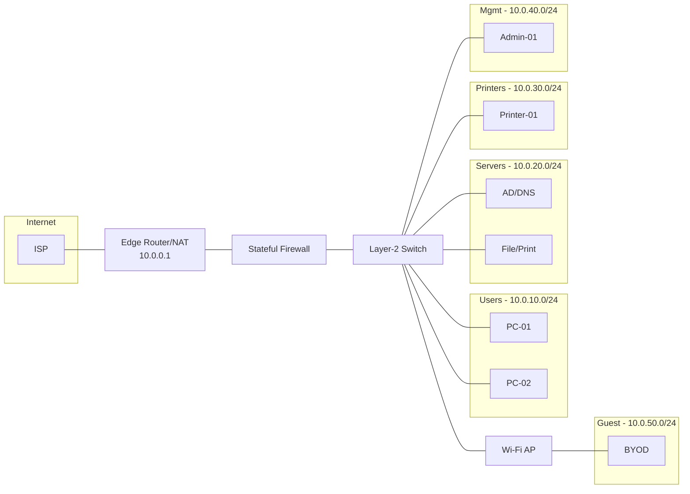

# Small Office Network Setup & Troubleshooting

A complete, portfolio-ready project that demonstrates best practices for designing, configuring, documenting, and troubleshooting a **small office network** for ~10–15 users.

## 🔧 Scope
- VLAN-segmented LAN (Users, Servers, Printers, Management, Guest Wi‑Fi)
- DHCP, DNS integration notes, and NAT to the internet
- Basic firewall rules (least privilege), port security, and logging
- Backup/export plan for network devices and recovery runbook
- Troubleshooting playbooks with reproducible labs

## 🗂 Repo Structure
```
.
├── configs/                 # Sample router/switch/AP configs
├── diagrams/                # Mermaid network diagram + exported PNG (optional)
├── docs/                    # Design doc, troubleshooting, backup & recovery
├── inventory/               # IP plan, device inventory, change log
├── scripts/                 # Helper scripts (PowerShell/Bash)
├── templates/               # Reusable templates for changes, incidents, tickets
└── README.md
```

## 🖼 Diagram (Mermaid)
> Edit this diagram in-code or import into draw.io / GitHub's Mermaid renderer.



## ✅ Getting Started
1. Review the **design** in `docs/design.md` and `diagrams/network-diagram.mmd`.
2. Apply sample **configs** from `configs/` in a lab (GNS3, EVE-NG, Packet Tracer).
3. Walk through **troubleshooting** in `docs/troubleshooting.md`.
4. Practice **backup and recovery** using `docs/backup_recovery.md`.
5. Track updates in `inventory/change_log.md`.

## 🧪 Validation Checklist
- [ ] Inter-VLAN routing works as intended
- [ ] Guest Wi‑Fi is isolated (no access to LAN subnets)
- [ ] DHCP scopes, reservations, and options tested
- [ ] Basic firewall rules enforced and logged
- [ ] Port security limits MACs on access ports
- [ ] Backups exported and verified with restore test

---

### 📜 License
This project is MIT-licensed so you can fork, extend, and reuse.
