# Small Office Network Setup & Troubleshooting

A complete, portfolio-ready project that demonstrates best practices for designing, configuring, documenting, and troubleshooting a **small office network** for ~10–15 users.

## 🔧 Scope
- VLAN-segmented LAN (Users, Servers, Printers, Management, Guest Wi‑Fi)
- DHCP, DNS integration notes, and NAT to the internet
- Basic firewall rules (least privilege), port security, and logging
- Backup/export plan for network devices and recovery runbook
- Troubleshooting playbooks with reproducible labs

## 🗂 Repo Structure
```
.
├── configs/                 # Sample router/switch/AP configs
├── diagrams/                # Mermaid network diagram + exported PNG (optional)
├── docs/                    # Design doc, troubleshooting, backup & recovery
├── inventory/               # IP plan, device inventory, change log
├── scripts/                 # Helper scripts (PowerShell/Bash)
├── templates/               # Reusable templates for changes, incidents, tickets
└── README.md
```

## 🖼 Diagram (Mermaid)
> Edit this diagram in-code or import into draw.io / GitHub's Mermaid renderer.

```mermaid
flowchart LR
  subgraph Internet
    ISP[ISP]
  end

  R1[Edge Router/NAT<br/>10.0.0.1]
  FW[Stateful Firewall]
  SW1[Layer-2 Switch]
  AP1[Wi‑Fi AP]

  subgraph VLAN10[Users - 10.0.10.0/24]
    PC1[PC-01]
    PC2[PC-02]
  end

  subgraph VLAN20[Servers - 10.0.20.0/24]
    SV1[AD/DNS]
    SV2[File/Print]
  end

  subgraph VLAN30[Printers - 10.0.30.0/24]
    PR1[Printer-01]
  end

  subgraph VLAN40[Mgmt - 10.0.40.0/24]
    MGMT1[Admin-01]
  end

  subgraph VLAN50[Guest - 10.0.50.0/24]
    GUEST1[BYOD]
  end

  ISP --- R1 --- FW --- SW1
  SW1 --- AP1
  SW1 --- PC1
  SW1 --- PC2
  SW1 --- SV1
  SW1 --- SV2
  SW1 --- PR1
  SW1 --- MGMT1
  AP1 --- GUEST1
```



## ✅ Getting Started
1. Review the **design** in `docs/design.md` and `diagrams/network-diagram.mmd`.
2. Apply sample **configs** from `configs/` in a lab (GNS3, EVE-NG, Packet Tracer).
3. Walk through **troubleshooting** in `docs/troubleshooting.md`.
4. Practice **backup and recovery** using `docs/backup_recovery.md`.
5. Track updates in `inventory/change_log.md`.

## 🧪 Validation Checklist
- [ ] Inter-VLAN routing works as intended
- [ ] Guest Wi‑Fi is isolated (no access to LAN subnets)
- [ ] DHCP scopes, reservations, and options tested
- [ ] Basic firewall rules enforced and logged
- [ ] Port security limits MACs on access ports
- [ ] Backups exported and verified with restore test

---

### 📜 License
This project is MIT-licensed so you can fork, extend, and reuse.
